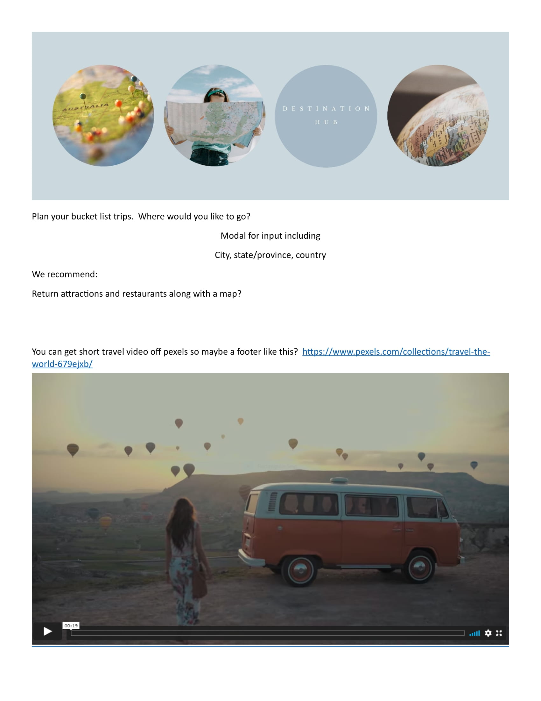
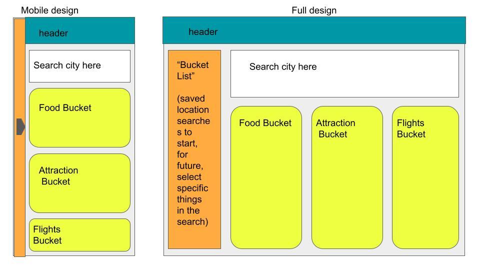

# destination-hub

## Project Checklist

### Project title and Description

 Title: Destination Hub
 
 Description: 

### Repository configured

### User Story

Here is a rough user story and acceptance criteria.  We can modify  and refine later!  User Story
AS A person that likes to travel, I WANT to enter a city I would like to travel to and have the app return the most popular attractions with nearby restaurants and travel maps.

-

### Wireframe or sketch of the design

-
### APIs identified
    https://www.geoapify.com/maps-api
### Issues created and assigned

Acceptance Criteria
    Given that I am looking for a bucket list trip, I should be presented with an option to enter a travel destination that is on my bucket list.  It should ask me to enter a city, state/province and country. It should ask me the radius in miles or km that I want to travel from that location to visit attractions.  When I enter the information, it should validate I have filled in all the fields and then it should return 5 local attractions based on my input and restaurants that are nearby.